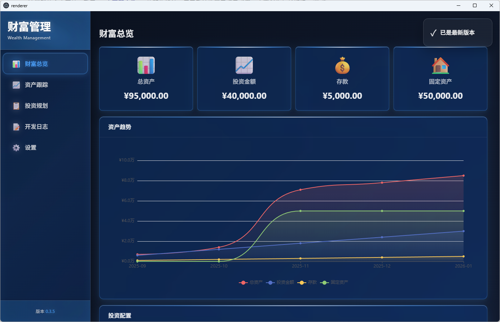
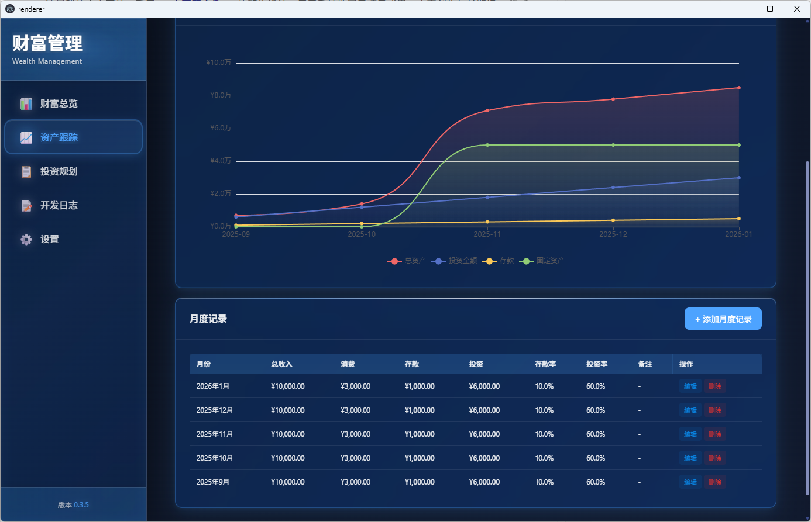
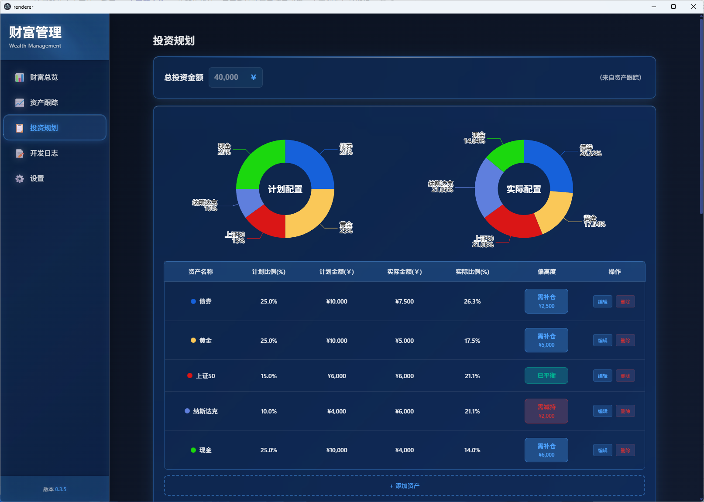
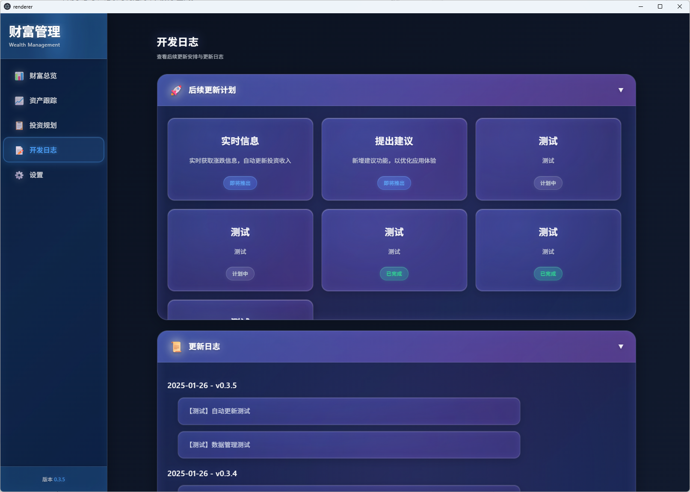

<p align="center">
  <h1 align="center">💰 Wealth Management</h1>
  <p align="center">一款简洁、私密的个人财富管理桌面应用</p>
</p>

<p align="center">
  
</p>

---

## ✨ 项目特点

| 特性 | 说明 |
|:---:|:---|
| 🔒 **私密安全** | 本地数据存储，完全掌控个人财务信息 |
| 🖥️ **跨平台** | 支持 Windows 和 macOS 桌面环境 |
| 📊 **可视化** | 丰富的图表展示，直观了解财富状况 |
| 🧩 **易扩展** | 模块化架构，组件设计清晰 |
| 🔄 **自动更新** | 基于 GitHub 的自动更新机制 |
| 🎨 **玻璃拟态** | 现代化的 Glassmorphism 设计风格 |

---

## 🛠️ 技术栈

```
├── 桌面框架:  Electron 40.x
├── 前端框架:  React 19.x + TypeScript 5.x
├── 构建工具:  Vite 7.x
├── 数据可视化: ECharts 6.x
├── 状态管理:  React Context API
├── 数据存储:  LocalStorage + 模块化存储服务
└── 设计风格:  玻璃拟态（Glassmorphism）
```

---

## 📸 功能展示

### 1️⃣ 财富概览

全面的资产统计与趋势分析，一目了然掌握财富状况。

<p align="center">
  
</p>

**功能亮点：**
- 💵 四大资产卡片：总资产、投资金额、储蓄、固定资产
- 📈 资产增长趋势图：平滑曲线展示累计资产变化
- 🍩 资产配置环形图：计划 vs 实际配置对比
- 🔄 实时数据更新

---

### 2️⃣ 资产记录

月度资产追踪，支持手动调整和历史数据管理。

<p align="center">
  
</p>

**功能亮点：**
- 📅 月度记录管理：收入、消费、储蓄、投资
- ✏️ 手动调整功能：灵活修正各项资产数据
- 📊 可视化趋势图：自定义显示数据类型
- 🗑️ 完整的增删改查操作

---

### 3️⃣ 投资规划

投资组合管理、复利计算、资产配置分析与操作建议。

<p align="center">
  
</p>

**功能亮点：**
- 🎯 投资组合管理：定义和管理不同投资资产
- 🧮 投资计算器：复利计算和未来投资规划
- ⚖️ 配置分析：对比计划与实际投资配置
- 💡 操作建议：智能推荐买卖建议以平衡配置

---

### 4️⃣ 更新日志

应用版本历史和功能更新记录。

<p align="center">
  
</p>

**功能亮点：**
- 📝 版本历史记录
- ✨ 功能更新说明
- 🐛 Bug 修复记录
- 🎉 新功能预告

---

## 🏗️ 架构设计

```
wealth-management/
├── 📁 main/              # Electron 主进程
├── 📁 renderer/          # React 前端代码
│   ├── 📁 components/    # 可复用 UI 组件
│   │   ├── Card          # 卡片组件
│   │   ├── Button        # 按钮组件
│   │   ├── Modal         # 模态框组件
│   │   └── ...           # 其他组件
│   ├── 📁 pages/         # 页面组件
│   │   ├── Overview      # 财富概览
│   │   ├── AssetTracking # 资产记录
│   │   ├── Investment    # 投资规划
│   │   └── UpdateLog     # 更新日志
│   ├── 📁 services/      # 业务服务层
│   │   ├── storage/      # 存储服务
│   │   └── data/         # 数据处理服务
│   └── 📁 hooks/         # 自定义 Hooks
└── 📁 shared/            # 共享代码
```

**核心设计原则：**
- 🧩 **模块化存储服务** - 按功能域划分的数据存储层
- 🎯 **自定义路由系统** - 基于 React Context 的轻量级路由
- 📦 **组件化设计** - 可复用的 UI 组件库
- 🔒 **类型安全** - 完整的 TypeScript 类型定义

---

## 📦 安装使用

```bash
# 克隆项目
git clone https://github.com/lzp/wealth-management.git

# 安装依赖
npm install

# 启动开发环境
npm run dev

# 构建生产版本
npm run build
```

---

## 📄 许可证

MIT License

---

<p align="center">
  Made with ❤️ by <a href="https://github.com/lzp">lzp</a>
</p>
